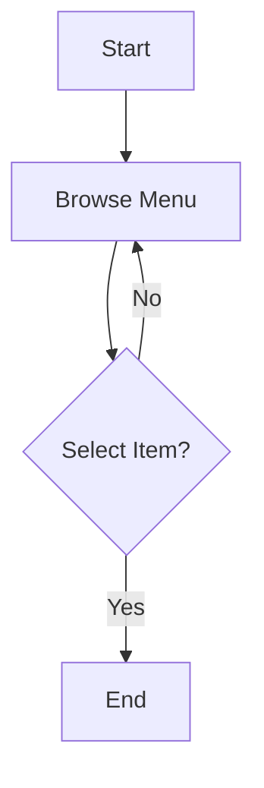
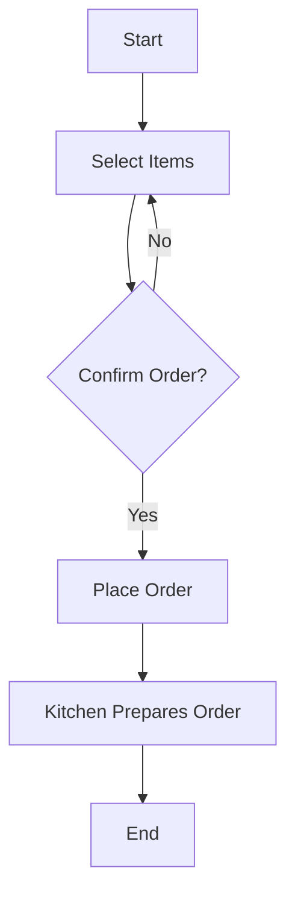
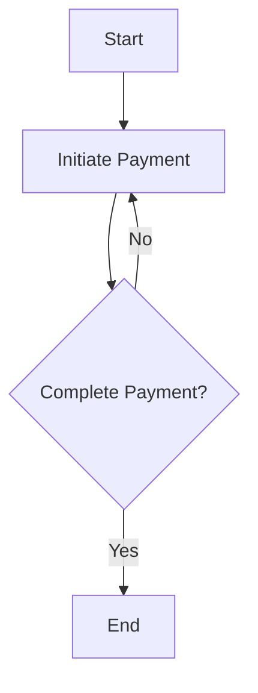
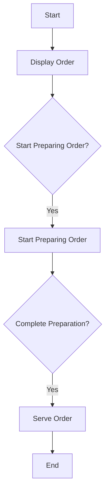
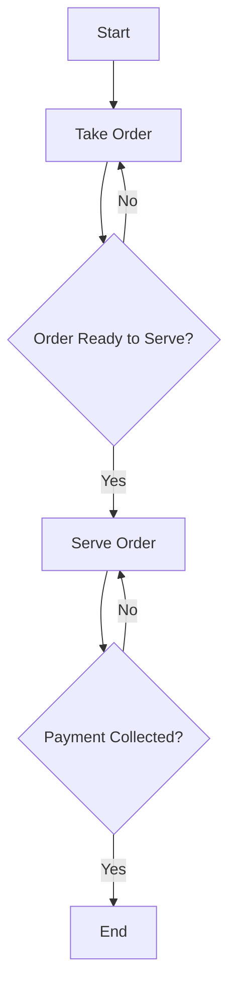
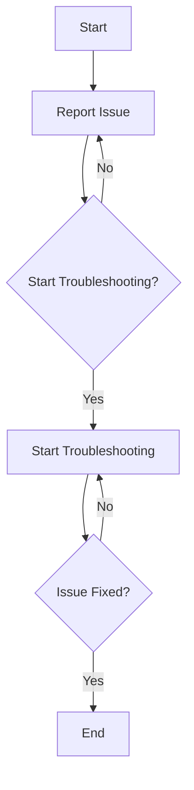
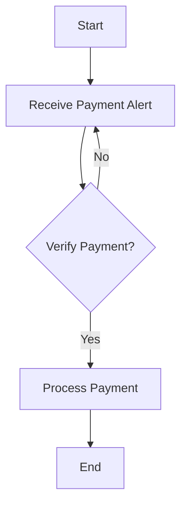
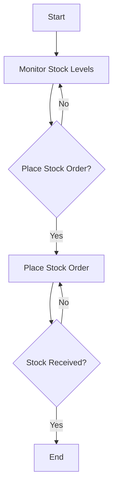
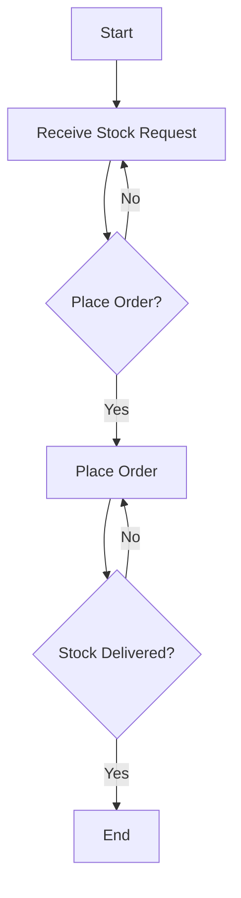

# Restaurant-POS Ordering Menu - Activity Workflows
- Customer
- Order
- Payment
- Kitchen Display
- Waiter
- Manager
- IT Admin
- Finance Institution Rep
- Supplier

---

# Activity Flow Diagrams

## 1. Customer Browsing the Menu at a Restaurant

## 2. Customer Making an Order at a Restaurant

## 3. Customer Making a Payment for an Order at a Restaurant

## 4. Kitchen Display System Displaying Orders for a Restaurant

## 5. Waiter Attending to an Order at a Restaurant

## 6. IT Admin Fixing System Issues for the Restaurant POS

## 7. Finance Institution Rep Receiving Payment Alerts

## 8. Restaurant Manager Managing Stock

## 9. Supplier Managing Stock Request from the Restaurant Manager

