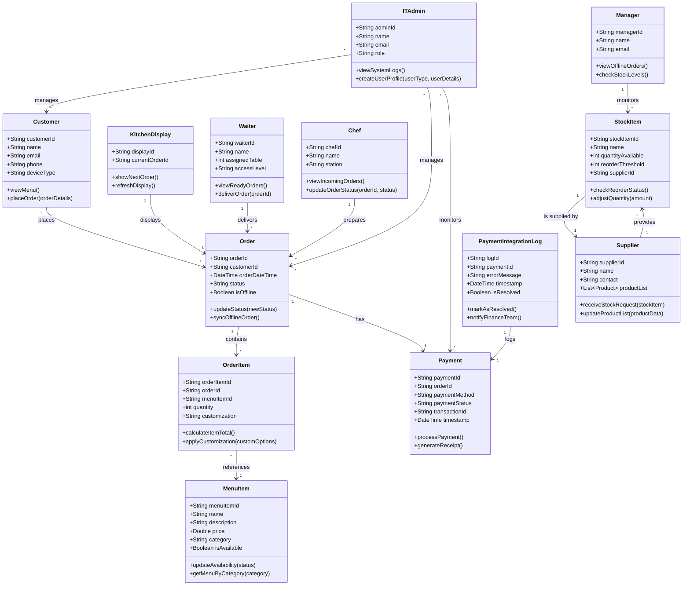

## Restaurant POS for Ordering Menu - Class Diagram

## Notes for the Diagram

The ordering procedure and stock management are represented by the two separate areas of the figure, which have been purposefully separated. Although there is an indirect relationship between ordering and stock because placing an order eventually influences stock levels, the two processes function independently in terms of workflow, which accounts for this separation. The ordering flow is not directly integrated with stock management, which is managed as a distinct operation.

A closer look reveals that the Manager, the Supplier, and the Stock Item are the only three main entities involved in the Stock Management section. This minimal engagement is intentional in an effort to streamline the process and avoid misunderstandings. Each system component's functionality can be better understood and maintained by clearly separating the roles and entities related to stock management from those involved in the ordering process. This structure also lends credence to the notion that stock management is a follow-up or subsequent process that may take place following the completion of the ordering process.
