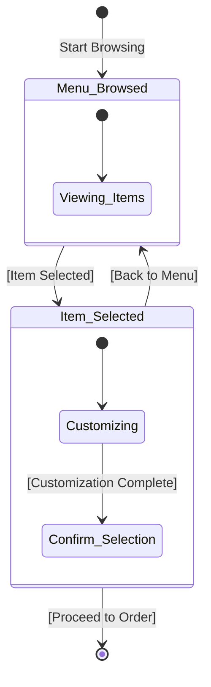
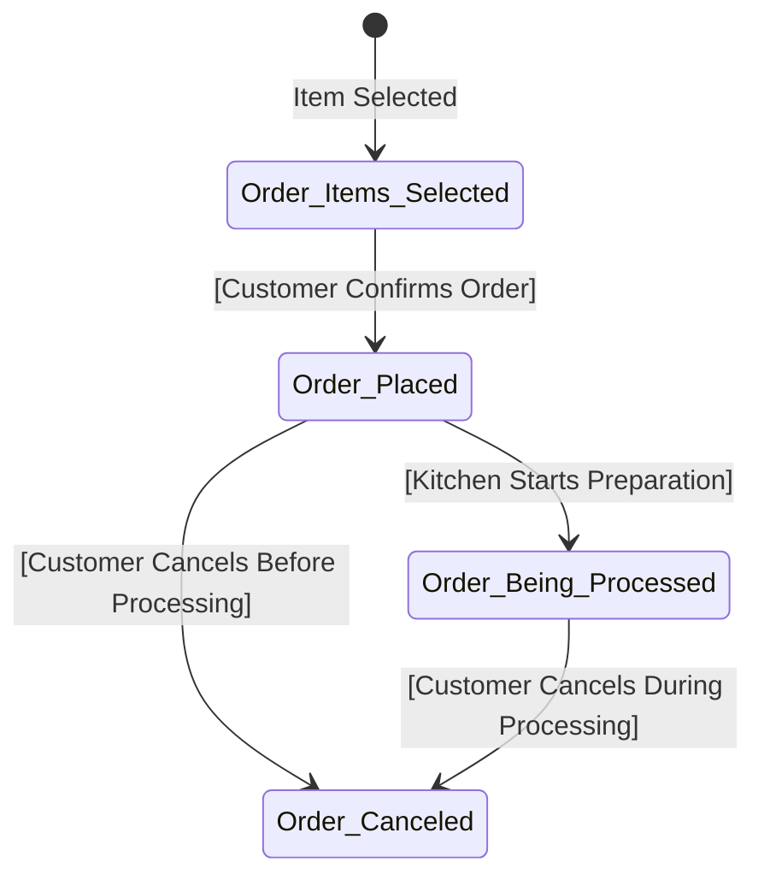
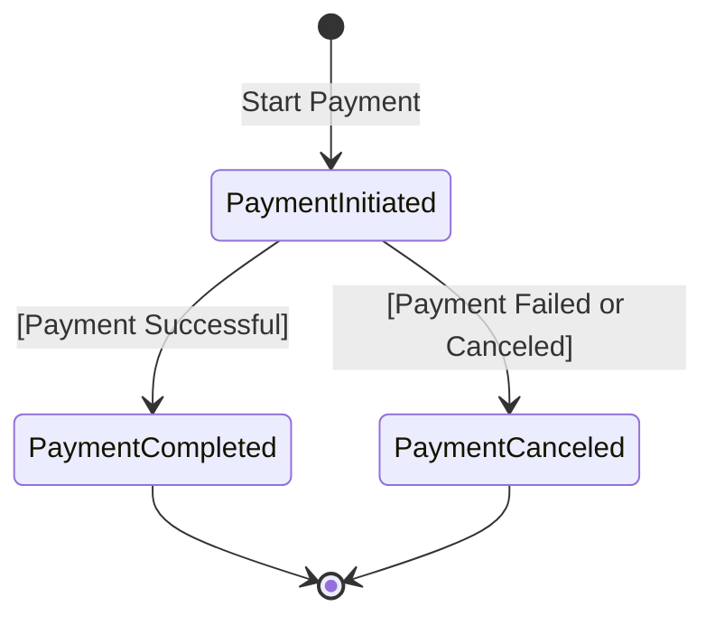
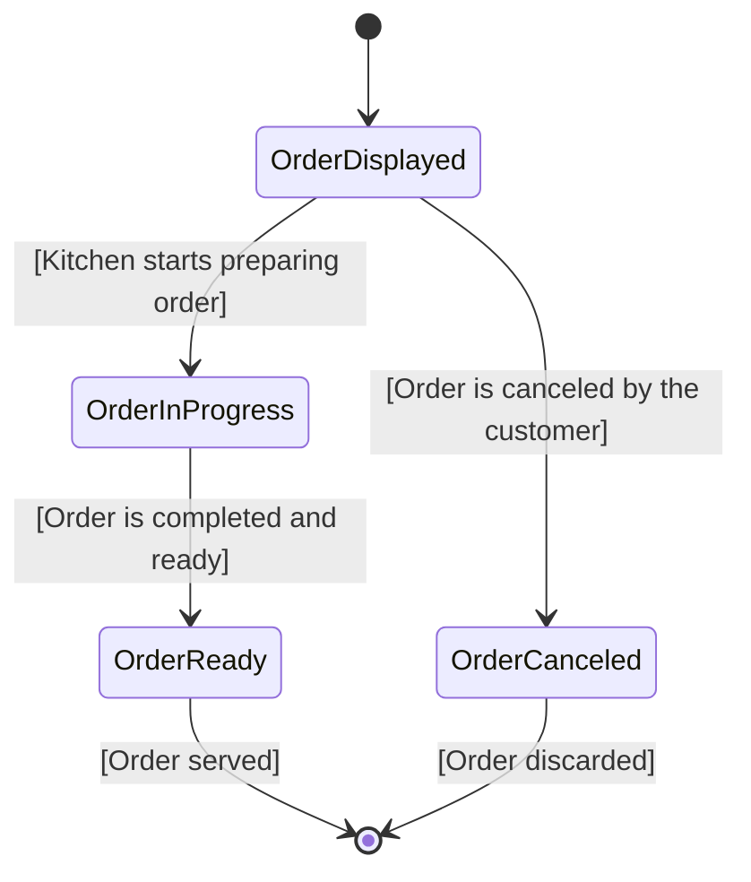
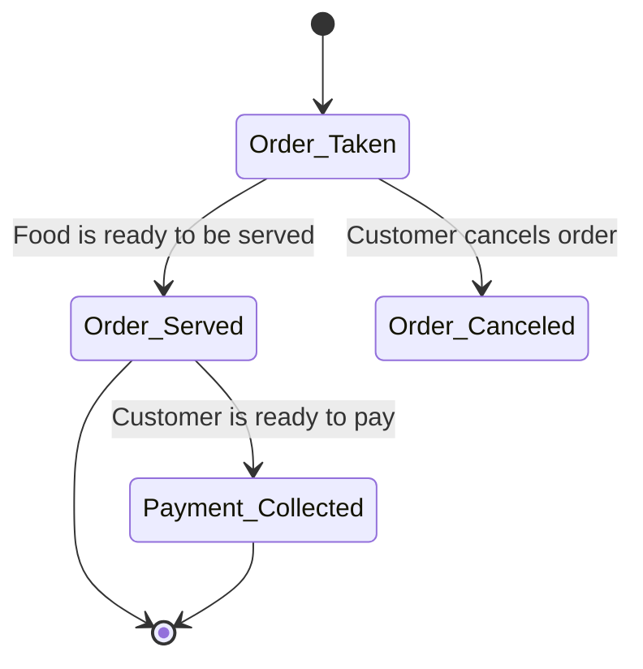
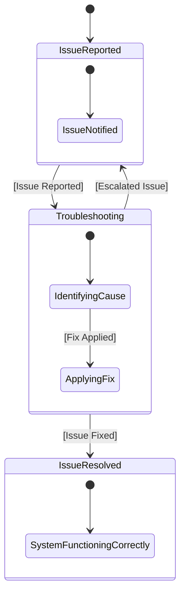
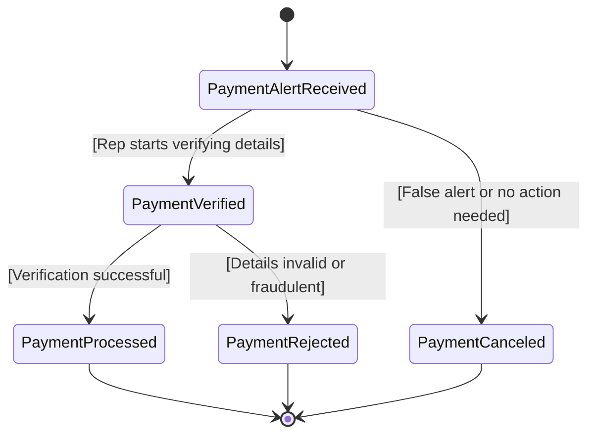
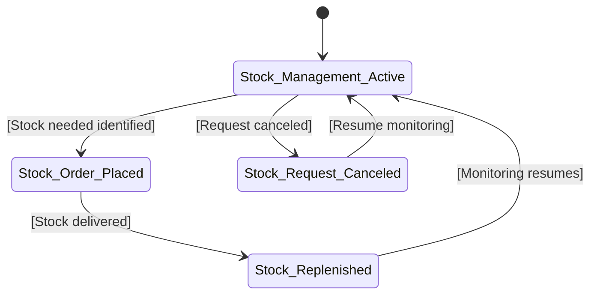
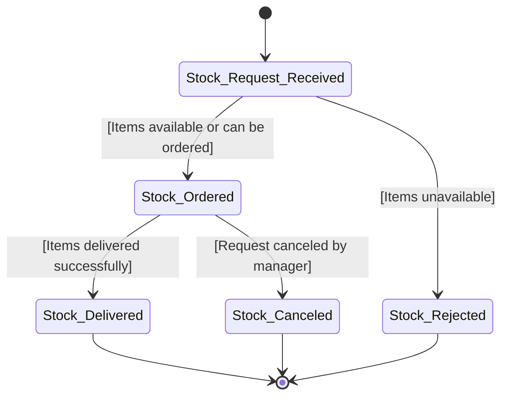

# Restaurant-POS Ordering Menu - Critical System Objects
- Customer
- Order
- Payment
- Kitchen Display
- Waiter
- Manager
- IT Admin
- Finance Institution Rep
- Supplier

---

# State Diagrams for each Object

## 1. Customer Browsing the Menu at a Restaurant

### States:
- **Menu Browsed**: The customer is browsing through the restaurant's menu and looking at available items.
- **Item Selected**: The customer selects an item from the menu.

### Transitions:
1. **Menu Browsed** → **Item Selected**  
   - **Guard Condition**: The customer selects an item from the menu.

### State Diagram:

## 2. Customer Making an Order at a Restaurant

### States:
- **Order Items Selected**: The customer selects the items they wish to order from the menu.
- **Order Placed**: The customer has confirmed their order and placed it with the restaurant.
- **Order Being Processed**: The kitchen is preparing the food after it was placed.
- **Order Canceled**: The order was canceled by the customer before being processed.

### Transitions:
1. **Item Selected** → **Order Items Selected**  
   - **Guard Condition**: The customer confirms their selection and chooses the items to order.

2. **Order Items Selected** → **Order Placed**  
   - **Guard Condition**: The customer places their order with the restaurant.

3. **Order Placed** → **Order Being Processed**  
   - **Guard Condition**: The kitchen starts preparing the food after the order is placed.

4. **Order Placed** → **Order Canceled**  
   - **Guard Condition**: The customer cancels the order before it is processed.

5. **Order Being Processed** → **Order Canceled**  
   - **Guard Condition**: The customer cancels the order after it is being prepared, but before it is served.

### State Diagram:

## 3. Customer Making a Payment for an Order at a Restaurant

### States:
- **Payment Initiated**: The customer has provided payment details (e.g., credit card or cash).
- **Payment Completed**: The payment has been processed and confirmed.
- **Payment Canceled**: The customer cancels or fails to complete the payment.

### Transitions:
1. **Payment Initiated** → **Payment Completed**  
   - **Guard Condition**: The payment is successfully processed.

2. **Payment Initiated** → **Payment Canceled**  
   - **Guard Condition**: The customer cancels or fails to complete the payment.

### State Diagram:

## 4. Kitchen Display System Displaying Orders for a Restaurant

### States:
- **Order Displayed**: An order has been received
- **Order In Progress**: The kitchen staff is preparing the order.
- **Order Ready**: The order is ready to be served to the customer.

### Transitions:
1. **Order Displayed** → **Order In Progress**  
   - **Guard Condition**: The kitchen staff starts preparing the order.
   
2. **Order In Progress** → **Order Ready**  
   - **Guard Condition**: The order is completed and ready for serving.

3. **Order Displayed** → **Order Canceled**  
   - **Guard Condition**: The order is canceled by the customer before preparation begins.

### State Diagram:

## 5. Waiter Attending to an Order at a Restaurant

### States:
- **Order Taken**: The waiter has taken the customer's order but has not yet served the food.
- **Order Served**: The waiter has served the food to the customer.
- **Payment Collected**: The waiter has collected payment for the order and the service is complete.

### Transitions:
1. **Order Taken** → **Order Served**  
   - **Guard Condition**: Food is ready to be served to the customer.
   
2. **Order Served** → **Payment Collected**  
   - **Guard Condition**: The customer finishes eating and is ready to pay.
   
3. **Order Taken** → **Order Canceled**  
   - **Guard Condition**: The customer cancels the order before it is served.

### State Diagram:

## 6. IT Admin Fixing System Issues for the Restaurant POS

### States:
- **Issue Reported**: The system has reported an issue, or the staff has notified the IT admin about a problem.
- **Troubleshooting**: The IT admin is working on identifying the cause of the issue and fixing it.
- **Issue Resolved**: The issue has been fixed, and the system is now functioning correctly.

### Transitions:
1. **Issue Reported** → **Troubleshooting**  
   - **Guard Condition**: The IT admin begins troubleshooting the issue after it has been reported.

2. **Troubleshooting** → **Issue Resolved**  
   - **Guard Condition**: The IT admin identifies the cause of the issue and applies a fix.

3. **Troubleshooting** → **Issue Reported**  
   - **Guard Condition**: The IT admin is unable to identify the issue and escalates it.

### State Diagram:

## 7. Finance Institution Rep Receiving Payment Alerts

### States:
- **Payment Alert Received**: The Finance Rep has received an alert regarding a payment (e.g., payment failure, payment received, overdue).
- **Payment Verified**: The Finance Rep is verifying the details of the payment to confirm its accuracy.
- **Payment Processed**: The payment has been successfully verified and processed.

### Transitions:
1. **Payment Alert Received** → **Payment Verified**  
   - **Guard Condition**: The Finance Rep begins verifying the payment details.

2. **Payment Verified** → **Payment Processed**  
   - **Guard Condition**: The payment verification is complete, and the issue is resolved.

3. **Payment Verified** → **Payment Rejected**  
   - **Guard Condition**: The payment details are incorrect or fraudulent.

4. **Payment Alert Received** → **Payment Canceled**  
   - **Guard Condition**: The alert turns out to be a false alarm or no action is required.

### State Diagram:

## 8. Restaurant Manager Managing Stock

### States:
- **Stock Management Active**: The manager is monitoring stock levels and requests for stock.
- **Stock Order Placed**: The manager has placed an order to replenish stock.
- **Stock Replenished**: The stock has been replenished and is now available for use in the restaurant.

### Transitions:
1. **Stock Management Active** → **Stock Order Placed**  
   - **Guard Condition**: The restaurant manager identifies a need for more stock and places an order.
   
2. **Stock Order Placed** → **Stock Replenished**  
   - **Guard Condition**: The stock order is fulfilled and the stock is delivered to the restaurant.

3. **Stock Management Active** → **Stock Request Canceled**  
   - **Guard Condition**: The manager decides to cancel or stop monitoring stock requests.

### State Diagram:

## 9. Supplier Managing Stock Request from the Restaurant Manager

### States:
- **Stock Request Received**: The supplier has received a request for stock from the restaurant manager.
- **Stock Ordered**: The supplier has placed an order to fulfill the restaurant's stock request.
- **Stock Delivered**: The requested stock has been delivered and is now in the restaurant’s inventory.

### Transitions:
1. **Stock Request Received** → **Stock Ordered**  
   - **Guard Condition**: The supplier verifies the request and places an order (items are in stock or need to be ordered from the warehouse).

2. **Stock Ordered** → **Stock Delivered**  
   - **Guard Condition**: The items are successfully delivered to the restaurant.

3. **Stock Request Received** → **Stock Rejected**  
   - **Guard Condition**: The stock request cannot be fulfilled due to unavailability.

4. **Stock Ordered** → **Stock Canceled**  
   - **Guard Condition**: The restaurant manager cancels the request after the order is placed.

### State Diagram:

