#                Masi - POS Ordering Menu - Use Case Diagram

### **System Overview**
The **Restaurant POS System** integrates multiple stakeholders, allowing seamless order management, food preparation, payment processing, and inventory control. Customers can place orders digitally, while the chef cooks the meals, and the kitchen staff & waiters process and deliver meals efficiently. IT Admins oversee system accuracy, with the assistance from the finance representatives, they ensure succefful integration between the POS system, its payment functionality and facilitate secure transactions to ensure smooth operation. The manager and supplier contribute to stock management, ensuring efficient restaurant operations.

This system enhances order accuracy, minimizes wait times, and optimizes staff workflow, resulting in an improved customer experience.

#     Use Case Diagram created using the Mermaid Code

```mermaid
%% Use Case Diagram for Masi Restaurant - POS for Ordering Menu
graph TD;
    %% Actors
    Customer((Customer))
    KitchenStaff((Kitchen Staff))
    Waiter((Waiter))
    Manager((Manager))
    ITAdmin((IT Admin))
    FinanceRep((Finance Institution Rep))
    Chef((Chef))
    Supplier((Supplier))

    %% System Boundary
    subgraph "Masi Restaurant - POS for Ordering Menu"
        UC1[Browse Menu]
        UC2[Place Order]
        UC3[Make Payment]
        UC4[View Orders]
        UC5[Process Orders]
        UC6[Update Order Status]
        UC7[View Ready Orders]
        UC8[Collect & Deliver Orders]
        UC9[Facilitate Payment]
        UC10[Ensure Orders are Captured Correctly]
        UC11[Handle Queries]
        UC12[Ensure Orders Appear on Kitchen Display]
        UC13[Maintain System Uptime]
        UC14[Create User Profiles]
        UC15[Fix Technical Issues]
        UC16[Assist with Payment Integration]
        UC17[Cooks]
        UC18[Supplies Products]
    end

    %% Relationships
    Customer -->|Uses| UC1
    Customer -->|Uses| UC2
    Customer -->|Uses| UC3
    KitchenStaff -->|Uses| UC4
    KitchenStaff -->|Uses| UC5
    KitchenStaff -->|Uses| UC6
    Waiter -->|Uses| UC7
    Waiter -->|Uses| UC8
    Waiter -->|Uses| UC9
    Manager -->|Ensures| UC10
    Manager -->|Handles| UC11
    Manager -->|Ensures| UC12
    ITAdmin -->|Maintains| UC13
    ITAdmin -->|Creates| UC14
    ITAdmin -->|Fixes| UC15
    FinanceRep -->|Assists| UC16
    Chef -->|Cooks| UC17
    Supplier -->|Supplies| UC18
```

# Use Case Diagram Image using application - https://online.visual-paradigm.com/

# Overview of Key Actors, their Roles, Relationship to the System and any Concerns Addressed by the System.

## 1. Customer
**Role:** The customer interacts with the system to place orders and complete payments. 
**Relation to the System:** Uses the system to browse the menu, order food, and make payments.
**Use Case Relationships:**
- **Browse Menu**: Customers explore available food options.
- **Place Order**: Customers select and confirm their desired food items.
- **Make Payment**: Customers complete transactions through the integrated payment system.
**Concern Addressed**: Customers do not have to wait for waiters to place orders.

## 2. Chef
**Role:** The chef is responsible for cooking food.
**Relation to the System:** Uses the system to view received orders.
**Use Case Relationships:**
- **Cooks**: Prepares meals according to customer orders.
**Concern Addressed:** Relying to waiters for correct orders to process

## 3. Kitchen Staff
**Role:** The kitchen staff is responsible for viewing, processing, and updating order statuses.
**Relation to the System:** Uses the kitchen display system to manage orders.
**Use Case Relationships:**
- **View Orders**: Kitchen staff access the order list.
- **Process Orders**: Kitchen staff prepare food items.
- **Update Order Status**: Kitchen staff mark orders as completed or in progress.
**Concern Addressed**: Orders are captured accurately to avoid conflicts with customers.

## 4. Waiter
**Role:** The waiter delivers food to customers and assists with payments.
**Relation to the System:** Uses the system to track ready orders and facilitate payments.
**Use Case Relationships:**
- **View Ready Orders**: Waiters check which orders are ready for collection.
- **Collect & Deliver Orders**: Waiters serve customers with their ordered food.
- **Facilitate Payment**: Waiters assist customers with payment processing if needed.
**Concern Addressed**: The work load is reduced, waiters do not have to run around taking orders and mixing them up due high volumes of customers.

## 5. Manager
**Role:** The manager ensures smooth order processing and handles customer queries.
**Relation to the System:** Uses the system to verify order accuracy and address issues.
**Use Case Relationships:**
- **Ensure Orders are Captured Correctly**: Ensures that all orders are correctly entered.
- **Handle Queries**: Addresses customer and staff concerns regarding orders.
- **Ensure Orders Appear on Kitchen Display**: Confirms that kitchen staff receive orders.
- **Maintains Stock**: Manages and updates inventory levels.
**Concern Addressed**: Table turnover has increased as customers no longer rely on waiters to place orders and the restaurant can operate with minimal stuff as orders can be processed digitally.

## 6. IT Admin
**Role:** The IT admin maintains the system and ensures its functionality.
**Relation to the System:** Manages user accounts and system uptime.
**Use Case Relationships:**
- **Maintain System Uptime**: Ensures the system operates without interruptions.
- **Create User Profiles**: Adds and manages staff accounts.
- **Fix Technical Issues**: Troubleshoots and resolves system errors.
**Concern Addressed**: Not Applicable

## 7. Finance Institution Rep
**Role:** Assists with financial transactions and payment integration.
**Relation to the System:** Ensures smooth payment processing between the system and financial institutions.
**Use Case Relationships:**
- **Assist with Payment Integration**: Helps in setting up and maintaining the payment gateway.
**Concern Addressed**: Payments are directly integrated to the institution ensuring real time payment, prevents having to collect loads of cash from the restaurant.

## 8. Supplier
**Role:** Supplies ingredients and products to the restaurant.
**Relation to the System:** Works with the manager to ensure inventory is stocked.
**Use Case Relationships:**
- **Supplies Products**: Delivers necessary items for restaurant operations.
**Concern Addressed:** Not Applicable
