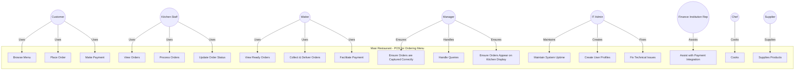

# Masi - POS Ordering Menu - Use Case Diagram

```mermaid
%% Use Case Diagram for Masi Restaurant - POS for Ordering Menu
graph TD;
    %% Actors
    Customer((Customer))
    KitchenStaff((Kitchen Staff))
    Waiter((Waiter))
    Manager((Manager))
    ITAdmin((IT Admin))
    FinanceRep((Finance Institution Rep))
    Chef((Chef))
    Supplier((Supplier))

    %% System Boundary
    subgraph "Masi Restaurant - POS for Ordering Menu"
        UC1[Browse Menu]
        UC2[Place Order]
        UC3[Make Payment]
        UC4[View Orders]
        UC5[Process Orders]
        UC6[Update Order Status]
        UC7[View Ready Orders]
        UC8[Collect & Deliver Orders]
        UC9[Facilitate Payment]
        UC10[Ensure Orders are Captured Correctly]
        UC11[Handle Queries]
        UC12[Ensure Orders Appear on Kitchen Display]
        UC13[Maintain System Uptime]
        UC14[Create User Profiles]
        UC15[Fix Technical Issues]
        UC16[Assist with Payment Integration]
        UC17[Cooks]
        UC18[Supplies Products]
    end

    %% Relationships
    Customer -->|Uses| UC1
    Customer -->|Uses| UC2
    Customer -->|Uses| UC3
    KitchenStaff -->|Uses| UC4
    KitchenStaff -->|Uses| UC5
    KitchenStaff -->|Uses| UC6
    Waiter -->|Uses| UC7
    Waiter -->|Uses| UC8
    Waiter -->|Uses| UC9
    Manager -->|Ensures| UC10
    Manager -->|Handles| UC11
    Manager -->|Ensures| UC12
    ITAdmin -->|Maintains| UC13
    ITAdmin -->|Creates| UC14
    ITAdmin -->|Fixes| UC15
    FinanceRep -->|Assists| UC16
    Chef -->|Cooks| UC17
    Supplier -->|Supplies| UC18
```
# Use Case Diagram Image using application - https://online.visual-paradigm.com/

